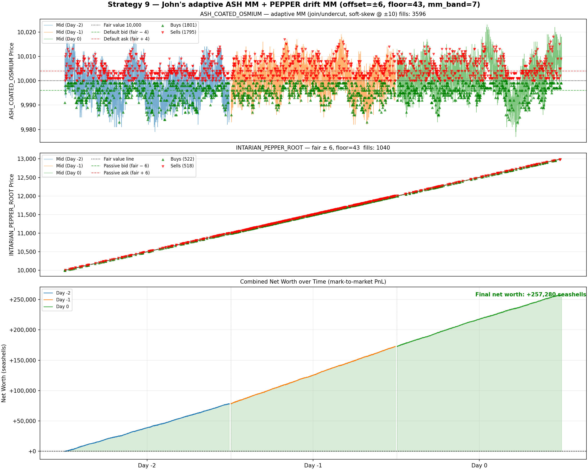

# Strategy 9 — John's adaptive ASH MM + PEPPER drift MM (floor=43, offset=6)

**Total profit over backtest (days -2, -1, 0): +257,280 seashells**

---

## Assets

| Asset | Role |
|---|---|
| ASH_COATED_OSMIUM | Adaptive join/undercut market-making (John's approach) |
| INTARIAN_PEPPER_ROOT | Long-biased linear-drift MM (floor=43, offset=±6, mm_band=7) |

Position limit: **50** per product.

## Thesis

Per-product isolation on `origin/John` vs strategy 4 revealed:

| Product | John | Strategy 4 | Delta |
|---|---|---|---|
| ASH_COATED_OSMIUM | +83,295 | +31,987 | **+51,308** |
| INTARIAN_PEPPER_ROOT | +149,669 | +151,107 | −1,438 |

John's advantage is **entirely in ASH**: his adaptive 4-step MM captures
~2.6× the spread of the fixed-quote 9,999 / 10,001 scheme. His PEPPER
(aggressive buy-to-max + single passive bid) is slightly *worse* than the
drift MM from strategy 8.

Strategy 9 takes the best of each:

1. **ASH_COATED_OSMIUM** — John's adaptive quoting:
   - Joins the inside of the book (within JOIN_EDGE=2) or undercuts the
     nearest non-trivial level.
   - Falls back to a ±4 default spread when the book is thin.
   - Skews: if pos > 10, tighten the ask by 1; if pos < −10, tighten the
     bid by 1 — actively works down extreme inventory.
2. **INTARIAN_PEPPER_ROOT** — strategy 8's floor=43 drift MM:
   - Holds a permanent long floor of 43 units to capture the full
     +0.1/tick linear drift.
   - Rotates the top 7 units through ±6 passive quotes.
   - Entered aggressively on tick < 100; exited aggressively at tick ≥ 29,900.

## Rules

**ASH_COATED_OSMIUM (John's 4-step):**

1. **Take**: if best ask ≤ 9,999 (fair − 1) → buy aggressively.
   If best bid ≥ 10,001 (fair + 1) → sell aggressively.
   Mutate depth to prevent double-counting in later steps.
2. **Clear**: if net position would be long after takes, sell into bids ≥
   10,000; if short, buy from asks ≤ 10,000.
3. **Make (join/undercut)**: find nearest ask > 10,001 and nearest bid <
   9,999 (ignoring the ±1 disregard edge). If within JOIN_EDGE=2 → join
   at that price; otherwise undercut/step by 1. Apply inventory skew.
4. **Place passive quotes**: size = `LIMIT − (pos ± accum_volume)`.

**PEPPER (floor=43, offset=6):**
- Entry ramp: aggressively buy to pos ≥ 43 (tick < 100).
- Middle: passive bid at `fair−6` refilling to 50; passive ask at `fair+6`
  sized only `pos − 43` (top 7 units rotate, floor of 43 never sold).
- Aggressive takes on any crossed book tick.
- Exit: aggressively flatten (tick ≥ 29,900).

## Backtest result (days -2, -1, 0, `reset_between_days=False`)

| Product | Final pos | Volume | Fills |
|---|---|---|---|
| ASH_COATED_OSMIUM | −35 | 19,069 | 3,596 |
| INTARIAN_PEPPER_ROOT | 0 (exited) | 4,394 | 1,040 |
| **Combined** | — | **23,463** | **4,636** |

**Final PnL: +257,280 seashells**



## Critical configuration

- **`reset_between_days=False`** — mandatory for PEPPER's overnight drift hold.
- **`passive_fills=True`** — both strategies rely on resting passive quotes
  being filled against same-tick market trades.

## Files

- `strategy9.py` — IMC-submittable single file; John's ASH constants + PEPPER
  (FLOOR=43, OFFSET=6)
- `plot_strategy9.py` — three-panel chart: ASH price + fills, PEPPER price +
  fair line ± 6 + fills, combined net worth
- `strategy9_net_worth.png` — backtest chart

## Run

```bash
python3 plot_strategy9.py
```

## Component strategies

| Strategy | File | Profit | Notes |
|---|---|---|---|
| Strategy 1 (ASH fixed MM) | `../strategy1/` | +31,664 | ASH only |
| Strategy 2 (PEPPER drift MM, offset=1) | `../strategy2/` | +151,107 | PEPPER only |
| Strategy 4 (combined, offset=1, floor=40) | `../strategy4/` | +183,094 | baseline combined |
| Strategy 6 (combined, offset=6, floor=40) | `../strategy6/` | +195,213 | optimised offset |
| Strategy 8 (combined, offset=6, floor=43) | `../strategy8/` | +196,173 | optimised offset + floor |
| John (origin/John) | — | ~+232,964 | adaptive ASH, aggressive PEPPER |
| **Strategy 9 (John ASH + S8 PEPPER)** | this folder | **+257,280** | best of both |
